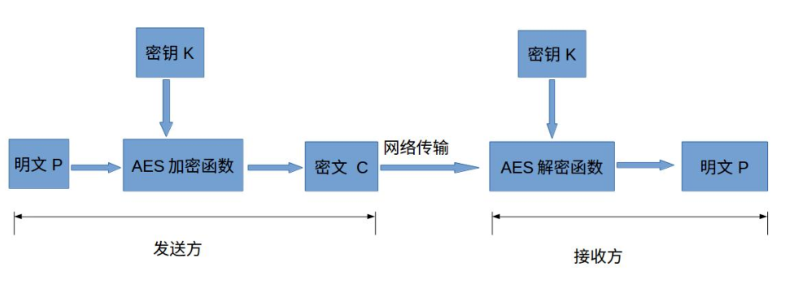
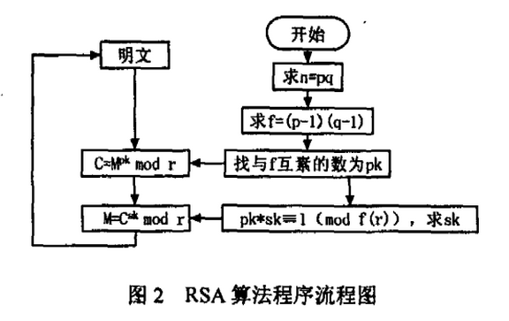

# 信息安全技术 - 加密算法作业

此为信息安全技术课程作业的算法源码作业提交。加密算法部分使用 Java 进行实现，文本对比由于效率关系使用 Python 实现；在完成作业要求的基础上，本程序集已实现对于文本文件进行 **AES128 + CBC**、**RSA** 等算法混合加密。

### 算法简介

#### AES128



算法流程如上图所示，其中密钥 K 长度和分组长度都为 4 个 32 位比特字，采用 10 轮的加密轮数。

#### RSA



RSA 加密与 AES128 有着很大的不同，其中最为显著的区别在于前者是非对称加密，而后者是对称加密。该算法可以用于加密以及数字签名等，但其也有缺点，**不支持太大长度的字符串加密**，并且**速度较慢**。对此我们采用的加密方法是**先通过 AES128 进行文件加密，然后再对 AES128 的密钥进行 RSA 加密**，从而解决了速度及大小的问题。

### 如何使用

**测试环境要求**：无

**调试环境要求**：JRE >= 1.8，Python >= 3

**测试步骤**：

1. 打开 `/test` 文件夹，运行 `Encryption.exe`，选择相应的算法进行加密；
2. 运行 `Decryption.exe`，选择与**相同的算法**进行解密；
3. 运行 `compare.exe`，对前后的文本进行校验，如果一致则会返回 Congratulations 字样，证明加解密算法没有数据丢失。

### 文件结构

**shared**：JRE 的存放文件夹，用于运行程序

**src**：源码文件夹，包含工程源码

- `src/com/algorithm`：算法类，包含 AES128 和 RSA 算法实现代码
- `src/com/decryption`：解密程序实现
- `src/com/encryption`：加密程序实现

**test**：测试文件夹，包括了已编译的二进制文件和测试文本样例，以供测试

- `test.txt`：测试文本文件，预先通过文章生成器填入了中文
- `Encryption.exe`：加密算法程序，由 exe4j 生成
- `Decryption.exe`：解密算法程序，由 exe4j 生成
- `compare.exe`：文本比较程序，由 pyinstaller 生成

>  由于实现算法时为了减少代码量，所以对读写文件进行了固定。如果需要修改文件请在源代码中修改项对应的地址。
>
> ```java
> String input_File = ".\\test_encrypted"; // 读取地址
> String output_File = ".\\test_recover.txt";  // 输出地址
> String RSA_Public_File = ".\\rsa.pub";  // 公钥存储地址
> String RSA_Private_File = ".\\rsa.pri";  // 私钥存储地址
> String AES_KEY_File = ".\\AES_KEY";  // 加密 AES 密钥地址
> ```
> 通过修改不同文件的内容可以对算法进行检查，密钥或文本错误会出现报错及闪退的情况。

### 如何编译

#### Java 编译

1. 使用 IDEA 将 `.java` 文件编译成 `.jar` 文件,并放入 `\test` 文件夹中
2. 使用 exe2j 进行配置，将目录设置到 `\test`
3. 将 JRE 的文件夹设置为 `../shared/jre`
4. 完成设置，生成 exe

#### Python 编译

1. 如果原环境过大，可以建立新的虚拟环境以减小程序打包后的体积
2. 安装 pyinstaller：`pip install pyinstaller`
3. 在 `\src` 目录下执行 `pyinstaller -F compare.py`
4. 将 `\dist` 目录下的 `compare.exe` 复制到 `\test` 中使用

### Credits and Information

**语言**：Java、Python

**IDE & Tools**：IntelliJ IDEA、Pycharm、VSCode、exe4j

**小组**：其实我在第五层

**组员**：张雨潮、任佳琛、陈泽睿、雷英佳、徐志成、李昊男

**参考文章**：

https://blog.csdn.net/chugeihe0588/article/details/100817352

https://blog.csdn.net/qy20115549/article/details/83105736

（代码在部分基础上进行修改）